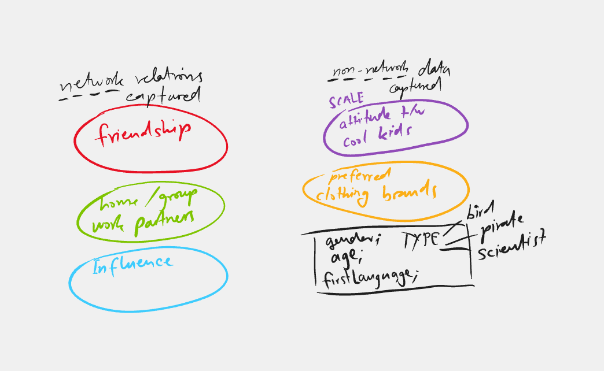
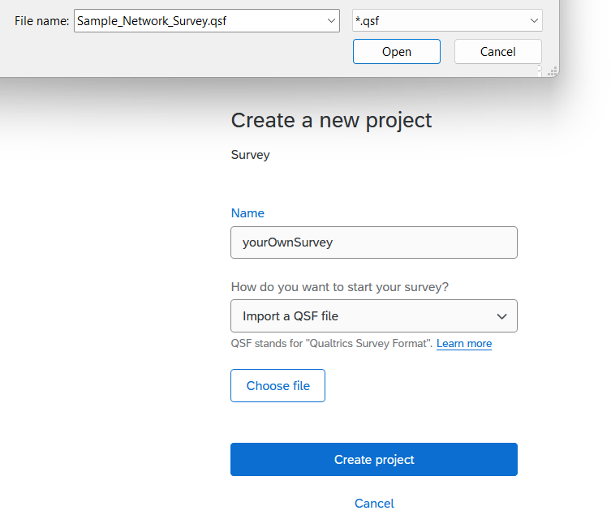
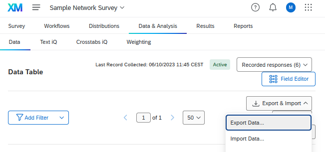
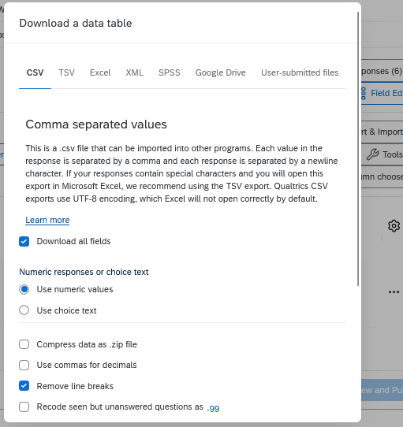

---
lab:
    title: 'Lab 20-2-A: Implementing Research Ideas in Qualtrics'
    module: 'Network Data Collection via Web Surveys'
---

# Marcel's Lab - Part A - Implementing Research Ideas in Qualtrics

## Lab requirements

You need to have R (preferably a recent version) installed on a Linux, Windows or MacOS PC.
You should have connected to [Qualtrics via the RUG-MyUniversity access](https://rug.eu.qualtrics.com/).

It would be beneficial if you have completed the [**Week6 Preparation - PART1**](https://brightspace.rug.nl/content/enforced/251026-GERMARS.2023-2024.1/Week%206.%20Preparation.html?ou=251026&d2l_body_type=3)

## What this sub-lab will teach you

- How to create a quick network-roster type survey for network-specific data collection...
    - capturing **network-specific relational data** between individuals of a defined population (within boundary)
    - adding **non-network specific data** to the network data collection
        - demographic information
        - depending on research ideas specifically designed question scales (like our AttitudeTowardsCoolKids scale)

- Kick-Off Data Collection
    - How to distribute the survey to your population of interest
    - How to monitor the data collection process
    

## Sub-Lab's Objective

This module is mainly about:

+ **Task 1: Implement your research plan (and hypothesis into a Qualtrics survey) - Lab 20-2-A**

This exercise will be particularly interesting for those of you who made notes during the first exercise (posted to Brightspace) and already thought about the suitability and feasibility of using a network approach for their research. 

(NB: preferably you have collected your own data, but in case that was not possible, or too difficult for some reason, we will also provide a sample dataset in the following)

<!-- 

 -->

### Instructions

## Task 1 - (Conceptual) Survey Framework

- Make a nice layout of your data bits and pieces (see example from [our preClass-Survey](https://rug.eu.qualtrics.com/jfe/form/SV_0wiK9xCaQNBOg5M) below)
    - i.e. the **network relations** you want to capture,
    - the directionality of those relations (which of the below shown network relations are **directed** and which are **undirected**?)
    - the **non-network information** you want to capture (and why you think these "attributes" are important for explaining network outcomes)

 

## Task 2: Go ahead in Qualtrics

In this task, you will create and configure your survey. There are many different ways of collecting network type data (see our ), but one of the most common is the **roster type survey**. In this type of survey, you first define the population of interest, and then you ask respondents to indicate their relations to other members of the population.

1. Sign in to the [**RUG - Qualtrics account**](https://rug.eu.qualtrics.com/).

1. Then go to [Create your first survey](https://rug.eu.qualtrics.com/app/catalog/projects/results?search=survey) **and** create a survey **from scratch** (as shown in the following screenshot).

    

    1. then give your survey project a name (e.g. **Lab 20-2-A**), and click **Create Survey**.
    
    1. From here you will have two options...

        
        1. either, you can build on a template that we have created for you (which is the recommended way forward for this lab)
        1. or, you can create your very own little network survey from scratch (based on examples you find in the SNA literature and/or our [recommended readings](https://brightspace.rug.nl/content/enforced/251026-GERMARS.2023-2024.1/Week%206.%20Content%20and%20materials.html?ou=251026&d2l_body_type=3))
         
        
        >**Note**: If you have not previously worked with Qualtrics or other online survey tools, you might want to look at the following link on [Survey component basics](https://www.qualtrics.com/support/survey-platform/survey-module/survey-module-overview/)

## Task 3: Importing the .qsf file for survey import

1. The recommended way forward is to use our pre-built **network roster-type** questions, which you can load via this [.qsf file](https://unishare.nl/index.php/s/7T72aAzobAezpCZ) that we have made available on [UniShare](https://unishare.nl/index.php/s/7T72aAzobAezpCZ). In case you want to build your very own network survey without any help, please skip this task.

>**Note**: please look up the official Qualtrics documentation for more help on [Importing and Exporting surveys](https://www.qualtrics.com/support/survey-platform/survey-module/survey-tools/import-and-export-surveys/#ExportingaSurveyasaQSF)

## Task 4: Modify the survey questions to match your research ideas

1. modify the survey items, as well as structure and logic to match your **(Conceptual) Survey Framework** (see above)
1. test your survey via the "Preview" button on the top right

## Task 5: Test your online-survey

1. (pre-)test your survey via the "Preview" button on the top right

## Task 6: Collect your data

1. when you are fairly certain that the survey is running flawlessly and collects the your network data as desired, click on the "Publish" button to go from testing to data collection mode.

1. then you distribute your survey to potential respondents there are many possible ways to do this - e.g. via a survey link or QR-code (both are a good way to get quick responses from your classmates)

>**Note**: again, the official Qualtrics documentation is your best friend here [Ways of Distributing your survey](https://www.qualtrics.com/support/survey-platform/distributions-module/distributions-overview/)

The next sub-lab will show you how to import the collected data into R.

## Task 7: Export your survey data

To export the collected survey data in an R-readable format...
1. go the **Data & Analysis** tab in Qualtrics
2. click on the **Export & Import** button
3. select **Export Data**
4. and then in the **Download a data table** menu select *csv* (comma separated values) as the file format
5. before you hit the download button, make sure to select **Use numeric values** instead of choice text (see screeshots below)
6. then download the .csv-file
7. and save it into a folder whose path you can easily navigate to later

## Task 8: Examine the .csv-file and the type of data generated

- Did you expect Qualtrics to save the data in this format?
-  In your opinion, can we work with the data like this and carry out network analysis?
- or do we need to transform it before?
- from your readings what would be viable strategies to transform the data into a format that is more suitable for network analysis?

>**Note**: Please go ahead on your own and open the **.csv-file** in Excel or so. Why don't you give it a go to try get the data into network format. [This tutorial](https://eehh-stanford.github.io/SNA-workshop/data-import.html) and [other tutorial](https://eehh-stanford.github.io/SNA-workshop/intro-SNA.html#setting-up-surveys) might help you with the task. Good luck!

## Congrats

You should have generated your very own network-suitable dataset now. We will continue here in the in-person lab session next week!

Reach out to me if you have any questions or problems with the above tasks.

Best wishes,
Marcel
<!--  Moving on to first sub-lab 20-3-B
Please move on to the next [sub-lab 20-3-B](LAB_20-3-B-DataFromQualtricsToR.md).
-->

