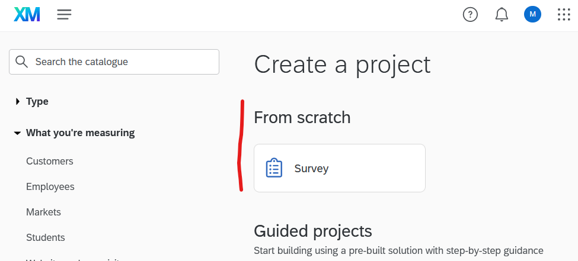

---
lab:
    title: 'Lab 20-2-A: Implementing Research Idea in Qualtrics'
    module: 'Network Data Collection and Survey Scales'
---

# Lab 20 - M Mallow's RUG teaching lab
# Student lab manual

## Pre-Lab requirements

You need to have R (preferably a recent version) installed on a Linux, Windows or MacOS PC.
You should have connected to [Qualtrics via the RUG-MyUniversity access](https://rug.eu.qualtrics.com/).

## What this sub-lab will teach you

- How to create a quick network-roster type survey for network-specific data collection...
    - capturing **network-specific relational data** between individuals of a defined population (within boundary
    - adding **non-network specific data** to the network data collection
        - demographic information
        - depending on research ideas specifically designed question scales

- Kick-Off Data Collection
    - How to distribute the survey to your population of interest
    - How to monitor the data collection process
    

## Sub-Lab's Objective

+ **Task 1: Implement your research plan (and hypothesis into a Qualtrics survey) - Lab 20-2-A**
<!-- + Task 2: Import the collected data into R - Lab 20-2-B
+ Task 3: Carry out exploratory network analysis in R - Lab 20-2-C
 -->
(NB: Task 1 should be carried out as preparatory work before the lab session, and Task 2 and 3 are carried out during the lab session)

## Estimated timing for this lab session: ~ 45 minutes

## Architecture diagram
<!-- 

 -->

### Instructions

## Exercise 1

- Make a nice layout of your data bits and pieces.
    - i.e. the network relations you want to capture,
    - the directionality of those relations
    - the non-network information you want to capture


   ```r
   
    library(igraph)
    library(ggraph)

    relations <- data.frame(from=c("Bob", "Cecil", "Cecil", "David", "David", "Esmeralda"),
                        to=c("Alice", "Bob", "Alice", "Alice", "Bob", "Alice"),
                        weight=c(4,5,5,2,1,1))

    # Load (DIRECTED) graph from data frame 
    g <- graph.data.frame(relations, directed=TRUE)

    # Plot graph
    plot(g, edge.width=E(g)$weight)
   ```


## Task 1: Go ahead in Qualtrics

In this task, you will create and configur your survey. There are many different ways of collection network type data (see slides), but one of the most common is the **roster type survey**. In this type of survey, you first define the population of interest, and then you ask respondents to indicate their relations to other members of the population.

1. Sign in to the [**RUG - Qualtrics account**](https://rug.eu.qualtrics.com/).

1. Then go to [Create a project](https://rug.eu.qualtrics.com/app/catalog/projects) or [Create your first survey] (https://rug.eu.qualtrics.com/app/catalog/projects/results?search=survey) **and** then create a survey **from scratch** (as shown in the following screenshot).

    

    1. then give your survey project a name (e.g. **Lab 20-2-A**), and click **Create Survey**.
    
    1. From here you will have two options...

        1. either, you can create your very own little network survey from scratch,
        1. or, you can build on a template that we have created for you.

        You see both options shown in the following screenshot. Please choose accordingly.
        
        

        >**Note**: If you have not previously worked with Qualtrics or other online survey tools, it might be wise to have a look at the following link on [Survey component basics](https://www.qualtrics.com/support/survey-platform/survey-module/survey-module-overview/)


1. Create a management group with the following settings:

    | Setting | Value |
    | --- | --- |
    | Management group ID | **az104-02-mg1** |
    | Management group display name | **az104-02-mg1** |

